# Akış Şeması Nedir?

Düz metin olarak yazılan bir algoritmanın her adımının farklı bir görsel şekil içerisine yazılması ve bu adımların birbirlerine oklar ile bağlanması ile oluşturulmasına akış şeması veya akış diyagramı diyoruz.

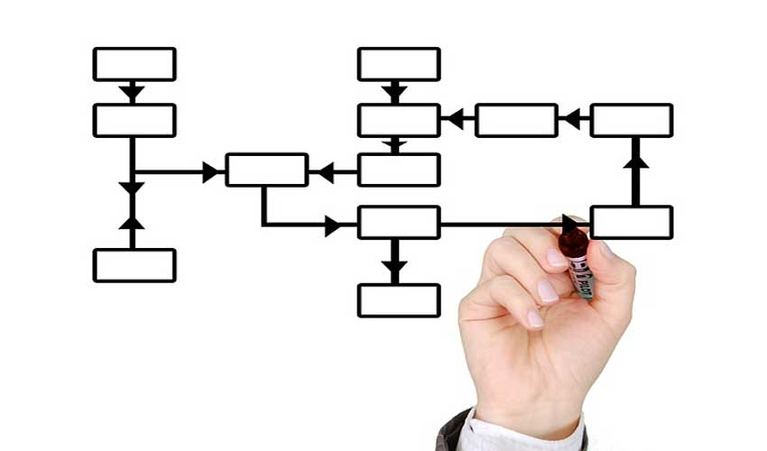

Yazılan algoritmanın her adımı bir şekil ile temsil edilir. Akış şeması oluştururken kullanacağımız **her şeklin farklı bir anlamı** bulunuyor.
Örneğin kullanıcıdan bilgi girilmesi istendiğinde farklı bir şekil, koşul durumlarında farklı bir şekil, işlemlerin yani hesaplamaların yapıldığı adımda farklı bir şekil vb..

Akış şeması ile oluşturulan bir algoritma, düz metin olarak oluşturulan algoritmaya göre genelde daha anlaşılır olarak kabul ediliyor. Bu yüzden algoritmalar oluşturulurken, akış şemaları düz metinlere göre **daha fazla tercih ediliyor**.

## Akış Şeması Şekilleri

| Akış Şeması Sembolleri | Açıklama Bilgisi |
|-|:-:|
| 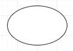 |Algoritmanın başladığını yada sona erdiğini belitmek için kullanılan akış şeması sembolüdür.|
| 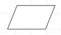 | Bilgi girişi yapılacağı durumlarda kullanılan akış şeması sembolüdür. Örneğin 2 sayının ortalamasını hesaplamak için, kullanıcıdan sayıları girmesini istediğimiz durumda kullanılır.|
| 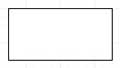 | Bir değişkene değer ataması yaparken veya hesaplama işlemlerini yaparken kullanılan akış şeması sembolüdür. |
| 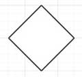 | Soru sorulan veya karşılaştırma yapılan durumlarda kullanılan akış şeması sembolüdür. Örneğin **2 > 0 (iki sıfır’dan büyükse )** ise veya **2 sayıyı topladın mı?** gibi soru ve karşılaştırma durumlarında kullanılır. Soru veya karşılaştırmanın sonucuna **(EVET veya HAYIR)** göre işlemlere devam edilir. |
| 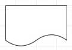 | Hesaplanan sonuçların veya üretilen bilgilerin kullanıcıya gösterilemesi için kullanılan akış şeması sembolüdür.|
| 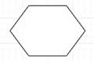 | Yapılan işlem eğer birden fazla defa tekrar edecekse yani bir döngüye giren işlem olduğu durumlarda kullanılan akış şeması sembolüdür.|
| 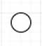 | Oluşturulan akış şeması bir sayfaya sığmayacak kadar büyükse daha küçük parçalara ayırabiliyoruz. Bu küçük parçaları birbirleri ile ilişkilendirmek için yani bağlamak için kullanılır.|
| 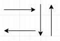 | Oluşturulan akış şeması sembollerini birbirleri ile ilişkilendirmek için yani bağlamak için kullanılır.|

### Şimdi örnekler üzerinde biraz daha pekiştirelim.

#### Örneklerimizin daha iyi  anlaşılması için olabildiğince basit seçeceğim.

- Örnekğin : **2 sayının ortalamasını hesaplayan algoritmayı** düz metin olarak yazalım. Daha sonra düz metinde yazmış olduğumuz algoritmayı akış şeması sembolleri ile yapalım.
    - A1 Başla
    - A2 Birinci sayıyı gir (a)
    - A3 İkinci sayıyı gir (b)
    - A4 İki sayıyı toplayıp sonucu **toplam** değişkenine ata (toplam = a + b)
    - A5 **toplam** değişkenini 2’ye böl ve sonucu **ortalama** değişkenine ata (ortalama = toplam / 2)
    - A6 **ortalama** değişkenini yaz
    - A7 Dur
    
    Bu problemi çözmek için **gerekli bütün adımları sıralı bir şekilde** yazarak algoritmamızı tamamladık. Gördüğünüz gibi hiçbir detayı gözardı etmeden her adımı detaylı bir şekilde yazdık.

    Şimdi de **akış şeması sembolleri** ile yapalım.

    - 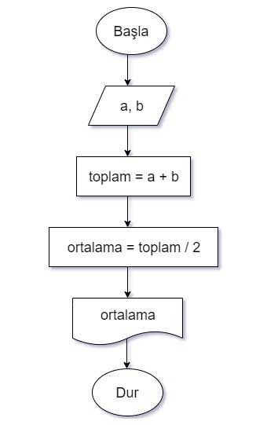

- İkinci örneğimizde de **birbirinden farklı girilen 2 sayıdan hangisinin küçük olduğunu bulan** algoritmayı düz metin olarak yazalım. Daha sonra düz metinde yazmış olduğumuz algoritmayı akış şeması sembolleri ile yapalım.
    
    - A1 Başla
    - A2 Birinci sayıyı gir (a)
    - A3 İkinci sayıyı gir (b)
    - A4 Eğer a < b ise ekrana **“Birinci sayı daha küçüktür”** yaz
    - A5 Eğer a < b değil ise ekrana **“İkinci sayı daha küçüktür”** yaz
    - A6 Dur

    Şimdi de **akış şeması sembolleri** ile yapalım.

    - 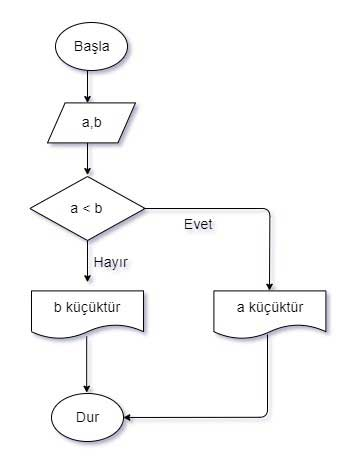

