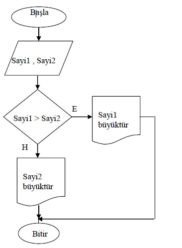

# Algoritma örnekleri

- Sayının karesini hesaplayan algoritma ve akış diyagramını tasarlayınız.
  
  ### Algoritması :
  
  - A1 Başla
  - A2 sayısal sayi,sonuc
  - A3 Yaz "Karesini alacağınız sayıyı girin"
  - A4 Oku sayi
  - A5 sonuc=sayi*sayi
  - A6 Yaz "Girdiğiniz Sayının Karesi:"+sonuc
  - A7 Bitir
  
  ### Akış Şeması :
  
  - 

- Kısa ve uzun kenarı girilen dikdörtgenin alanını ve çevresini hesaplayarak ekranda gösteren algoritma ve akış şeması örneği.
 
  ### Algoritması :

  - A1 BAŞLA
  - A2 SAYISAL(kisa,uzun)
  - A3 OKU kisa
  - A4 OKU uzun
  - A5 alan=kisa*uzun
  - A6 cevre=2*(kisa+uzun)
  - A7 YAZ(alan)
  - A8 YAZ(cevre)
  - A9 BİTİR

  ### Akış Şeması :

  - 

- Birbirinden farklı olarak verilen iki adet sayıdan, büyük olanı bulup gösteren algoritma ve akış diyagramını tasarlayınız.
  
  - 

- Verilen tamsayının sıfır, pozitif ya da negatif olup olmadığını bulan algoritma ve akış diyagramını tasarlayınız.

  - 

- Kullanıcı tarafından girilen 2 sayıyı alarak bu iki sayının ortalamasını hesaplayan ve sonucunu gösteren algoritma ve akış şeması örneği.

    - 