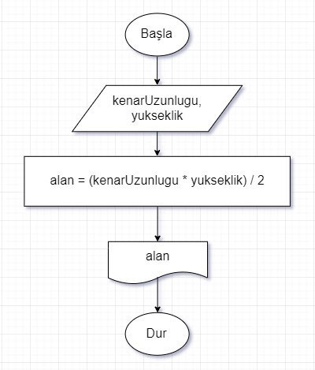

# **Algoritma**

Algoritma, belli bir problemi çözmek veya belirli bir amaca ulaşmak için tasarlanan **yol** anlamına gelir.

Bir problemin, matematik veya bilgisayar bilimlerinde çözüm bulabilmesi için adım adım açıklanarak tasarlanan yoldur. Sorunun çözülmesi için **adımlar belirlenir**. Adımlara uygun bir şekilde **işlemler yapılır**. Adımlar, **herkesin anlayabileceği** şekilde özenle tasarlanır. Genelde, programlama dillerinde kullanılır.

> **Not:** Programlamanın temeli, algoritmaya dayanır.

> **Not:** Algoritma bir programlama dili değildir. Programlama dilleri için yol gösteren, mantıksal adımlar dizisidir.

İlk algoritma, El-Harezmi’nin 6ncı yüzyılda yazdığı ‘Hisab-el Cebir ve El Mukabala’ kitabında sunulmuştur ve algoritma kelimesi de **_[El-Harezmi](https://www.ilkkimbuldu.com/harizmi-kimdir/)_** ’nin isminden gelmiştir.

Kısaca **algoritma**, elimizde var olanlarla **sonuca ulaşma şemasıdır**. Kodlama, bu tarife, yani algoritmaya bakılarak yapılır. __*Kod yazarken asıl zor kısım, algoritma çıkarmaktır.*__

Her program, aynı sorun için tek bir yoldan gitmez. Aynı sorunun birden fazla yolu olabileceği gibi algoritmaları da çeşitlidir. Burada önemli olan, sorunun çözülmesi için başlatılan algoritmanın son bulabilmesidir. **Sonsuza kadar işleyen süreçlere, algoritma denemez.**

## Programlamaya başlamadan önce algoritma ve akış şeması oluşturmanın avantajları:

- Kodlamaya geçmeden önce algoritma veya akış şeması oluşturmak **program yazmayı kolaylaştırır**.
- Kodlarımızı yazarken hatalı kod oranını **ciddi anlamda azaltır**.
- Program yazımı için gerekli süreyi **kısaltır**.
- Program kontrolünü ve hata takibini **kolaylaştırır**.
- Program üzerinde daha sonra yapılacak düzenlemelerde **kolaylık sağlar**.

## Her algoritmanın bulundurması gereken genel özellikler:

- Her algoritma, **başlatılmalıdır**.
- Her bir adım, açık bir şekilde **sırayla** yazılmalıdır.
- Tüm koşullar göz önünde bulundurulmalıdır ve **genel** olmalıdır.
- Algoritma, geliştirmelere yani **değişikliklere açık** olmalıdır. 
- Belirli adımlar bittikten sonra program **sonlanmalıdır**.
  
Algoritmada ana **3 kısım** vardır. Bunlar; **değişkenler, algoritma(gidişat) ve akış diyagramıdır**.

## **Değişkenler**

Değişkenler, verileri tutması için hafızada açılan kutucuklara verdiğimiz isimlerdir. Her seferinde farklı değerler içerebilen yapıdır. Programlarda, İnternet sitelerinde boş kutucuklara girilen her bilgi değişkendir.
Değişkenler, yapılan işlemler sonucu oluşturulan veya kullanıcı tarafından girilen verileri tutmak için kullanılır. 

## **Akış Diyagramları**

Çözülecek problemin, çözüm süreçlerinin şekillendirilmiş haline akış diyagramı denir. Bu diyagram, sürecin parçalarını ve parçalar arası ilişkiyi gösteren ve anlaşılmasını kolaylaştıran şekillerdir. Bilgisayar programlarında da algoritma oluşturulmadan önce akış diyagramı oluşturulur. Ardından algoritmalarla içleri doldurulur.

### Akış Diyagramı örnekleri:

- 

- 

## ALGORİTMALARI İFADE ETME TÜRLERİ

    Algoritmaları genel olarak 3 farklı şekilde ifade edebiliyoruz. Bunlar:

1. **Algoritmanın metin olarak yazılması**: Bu yöntemde algoritmanın tüm adımları düz metin olarak açıkça yazılır.
2. **Algoritmanın sözde kodlarla yazılması**: Bu yöntemde algoritmanın tüm adımları yarı kodlarla veya kısaltmalarla yazılır.
3. **Algoritmanın akış şemasının çizilmesi**: Bu yöntemde algoritmanın tüm adımları belirli şekillerle ifade edilir.

Şimdi örnek bir algoritma belirleyelim ve bu algoritmayı 3 farklı şekilde nasıl ifade edebileceğimize bakalım.

### **Örnek Algoritma**:  Bir kenar uzunluğu ve o kenara ait yüksekliği girilen üçgenin alanını hesaplayan algoritmayı 3 farklı şekilde yazınız.

#### Algoritmanın Metin Olarak Yazılması

- A1 Başla.
- A2 Üçgenin kenar uzunluğunu gir.
- A3 O kenara ait yüksekliği gir.
- A4 Kenar uzunluğu ile yüksekliği çarpıp 2’ye böl ve Sonucu **alan** değişkenine ata.
- A5 Alan değişkenini ekrana yaz.
- A6 Dur.

#### Algoritmanın Sözde Kodlarla Yazılması

- A1 Başla.
- A2 kenarUzunlugu gir.
- A3 yukseklik gir.
- A4 alan = (kenarUzunlugu * yukseklik) / 2.
- A5 alan değişkenini yaz.
- A6 Dur.

#### Algoritmanın Akış Şeması ile İfade Edilmesi

- 

## **Günlük Hayattan Basit Algoritma Örnekleri**

En basitinden **çay demleme süreci**. Günlük hayatta çoğumuz çay demlemişizdir. Ama kimse, çaydanlığı su doldurmadan ocağın üstüne koymamıştır. Ya da suyu açıp, çakmağı da çeşmeye tutmamıştır. Bu, hayatında hiç çay demlememiş birinin bile kolay kolay yapmayacağı bir davranış olurdu. Yine de küçük bir oran bırakalım. :))

Aşağıdaki örneklerin çok basit olduğunu düşünebilirsiniz. Sakın göz ardı etmeyin. **Algoritma nedir** sorusunun cevabını anlamak için **büyük önem taşıyorlar**.

- ### Çay Demleme Algoritması
     Alışkın olduğumuz bu basit sürecin algoritmasını, milisaniyeler içinde aklımızda tasarlarız. Şunun gibi:

     1. Çaydanlığı bul.
     2. Temiz mi? Kontrol et.
     3. Temiz ise devam et. Değilse Temizle.
     4. Su bölümüne yeterince su doldur.
     5. Ocağı yak.
     6. Su dolu çaydanlığı, yanan ocağın üstüne koy.
     7. Suyun kaynamasını bekle.
     8. Su kaynadıysa demliğe çay koy.
     9. vs. vs. vs.vs.

- ### Ekmeğe Reçel Sürme Algoritması

    Başka bir örnek vermek gerekirse; **ekmeğe reçel sürmek**… Şimdi bu basit sorunu beraber ele alalım. Birinden nasıl isteriz bunu? “Ekmeğe reçeli sür!” komutunu kullanırız. Anlamasını bekleriz ve büyük bir ihtimalle anlamıştır. 

    Şimdi, sorular sorarak koşulları değerlendirelim:

    **Ekmek var mı**? Kişi bunu kontrol etmedi. Hadi, ‘var’ diyelim. Ekmeği aldım. Elimde bütün bir ekmek var. Sonuçta alınan ekmeğin kesilip kesilmediği belli değil. ‘Ekmeğe reçeli sür’ komutunu verdiğimiz kişiye de bunu belirtmedik. Elimde hala tam bir ekmek var. **Reçel kavanozunu aldı ve tam ekmeğe sürdü**. Evet doğru, çünkü biz bunu dedik. Ama bunun yerine aşağıdaki şekilde belirtirsek, daha açıklayıcı olacaktır.

    - Ekmek var mı kontrol et? Yoksa bakkaldan al.
    - Ekmek bütünse kendine yetecek kadarını bıçakla kes.
    - Ekmeğin istediğin kısmına bıçak / çatal ile reçel kavanozundan aldığın reçeli sür.
    
    Peki oldu mu? **Hayır olmadı**. İşi yapacak kişi, ekmek yoksa bakkala gitti ve geri dönmedi. **Kavanozda reçel var mıydı**? Bilmiyoruz. Peki reçel kavanozu var mıydı? Bunu da bilmiyoruz. Bıçağı, nasıl tutacağını ve ekmeği nasıl kesmesi gerektiğini dahi söylemedik. Günlük hayatta biz bu işi yaparken, adım adım ne yapmamız gerektiğini biliyoruz.

    Burada önemli olan bildiğimizi algoritma ile uygun bir şekilde açıklayabilmek. Bunları tam anlamıyla yaptığımızda, tüm koşullar göz önüne alınmış olur. Bilmeyen birine açıklanabilir. Bu süreci bir yazılıma ya da robota yaptıracağınızı düşünebilirsiniz.

    Bu şekilde düşünerek, örnekler çözmek, kendimizi algoritma açısından daha da geliştirmemizi sağlayacaktır. Bu arada işi yapacak kişide **para var mıydı**? **Bakkalın yolunu biliyor muydu**? **Peki bıçağın yerini biliyor muydu**, biliyorsa boyu yetiyor muydu? Küçük bir çocuğa da anlatıyor olabiliriz. Düşündükçe koşullar artıyor. 

    ## __*Farklı çözümler, zenginliktir.*__

    Problem çözümlerinde, herkesin oluşturduğu **algoritma aynı olmak zorunda değil**. Düşünceler, gidişat, yollar farklı olsa da **sonuç aynı** olabilir. Matematik’ te ve normal hayatta olduğu gibi **bir sorunun birden fazla çözümü olabilir**.

    ### **_[Algoritma örnekleri geçebilirsiniz.](algoritma-ornekleri.md)_**